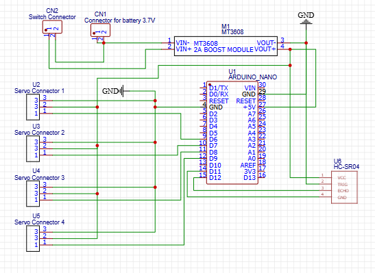
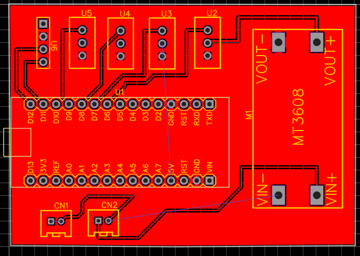
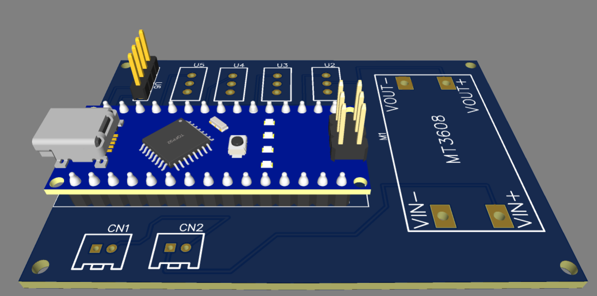

# Robot Dog PCB Design

## Overview

This project is a PCB design for a robot dog. The board was designed using EasyEDA and is based on an Arduino Nano as the main microcontroller.

The PCB provides connections for four servo motors and an HC-SR04 ultrasonic sensor. It also includes a power section with a 3.7V battery connector, a switch connector, and an MT3608 boost module.

The PCB was designed as a double-layer board with organized component placement and labeled connectors.

--

## Components

- Arduino Nano
- 4 × Servo connectors
- HC-SR04 ultrasonic sensor connector
- MT3608 2A boost module
- 3.7V battery connector
- Switch connector

---

## Pin Assignment

| Component | Arduino Nano Pin |
|---|---|
| Servo 1 | D6 |
| Servo 2 | D7 |
| Servo 3 | D8 |
| Servo 4 | D9 |
| HC-SR04 TRIG | D11 |
| HC-SR04 ECHO | D12 |

---

## Power

The PCB is designed to receive power from a 3.7V battery. The battery is connected to the MT3608 boost module, which is used to increase the voltage for the required power supply.

A switch connector is also included to control the power connection.

---

## PCB Design Process

The PCB was designed using EasyEDA through the following steps:

1. Created the circuit schematic.
2. Connected the Arduino Nano, servo connectors, HC-SR04 connector, and power components.
3. Assigned footprints to the components.
4. Converted the schematic into a PCB layout.
5. Arranged the components in an organized layout.
6. Connected the components using PCB traces.
7. Designed the PCB using two copper layers.
8. Checked the final board using the 3D view in EasyEDA.

---

## Connections

The four servo connectors provide three connections for each servo:

- Signal
- VCC
- GND

The HC-SR04 connector provides four connections:

- VCC
- TRIG
- ECHO
- GND

All required components share a common ground connection.

---

## Design Files

The project contains the EasyEDA schematic and PCB design files.

---

## Result

The final result is a double-layer PCB designed to serve as the main control board for a robot dog. It integrates the Arduino Nano, four servo connections, an ultrasonic sensor connection, and the power supply section into one organized PCB.

---

## Software

- EasyEDA

---

## Schematic

## PCB Layout

## 3D View

---

# 👩‍💻 Author

**Nassebah Al-Dubayyan**

Computer Science Student

⭐ If you found this project interesting, consider giving it a star!

